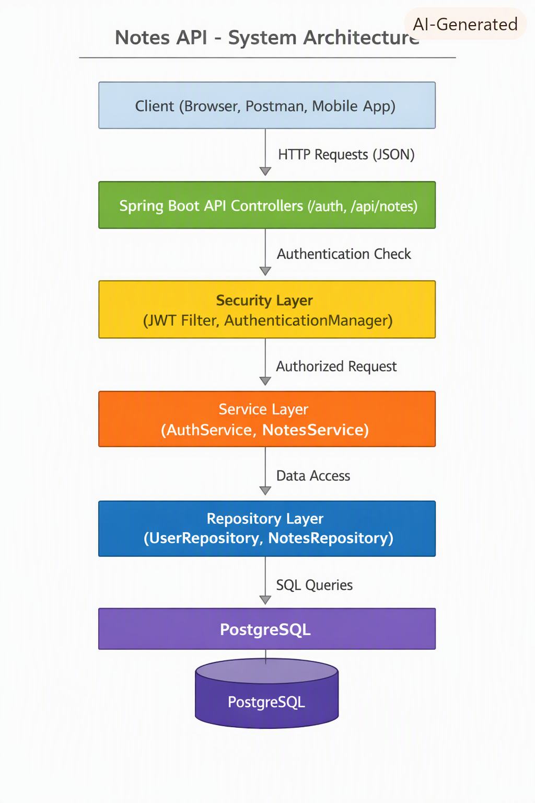
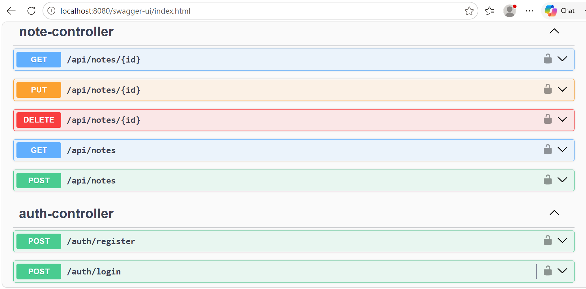

# Notes API - Spring Boot + JWT + Docker

<p align="center">
  
  
  
  
  
  
</p>

---

## Table of Contents

- [Overview](#overview)
- [Quick Start](#quick-start)
- [Features](#features)
- [Technologies Demonstrated](#technologies-demonstrated)
- [Tech Highlights](#tech-highlights)
- [Architecture Diagram](#architecture-diagram)
- [Running with (Docker)](#running-with-docker)
- [Run Locally (Without Docker)](#run-locally-without-docker)
- [Project Structure](#project-structure)
- [Interactive API Docs](#interactive-api-docs)
- [Authentication Endpoints](#authentication-endpoints)
- [Notes Endpoints](#notes-endpoints)
- [Testing](#testing)
- [Roadmap](#roadmap)
- [Contributing](#contributing)
- [Contributors](#contributors)
- [Author](#author)
- [Change Log](#change-log)
- [License](#license)

---

## Overview

A clean, modern REST API for creating and managing notes. Built with Spring Boot 3, secured with JWT authentication,
and backed by PostgreSQL. The API provides user registration, login, and full CRUD operations for notes. It is fully
containerized using Docker and documented with Swagger for easy exploration.

This project demonstrates industry‑standard backend engineering practices including secure authentication, layered
architecture, database persistence, containerization, and automated testing. It serves as a strong foundation
for future enhancements such as pagination, refresh tokens, role‑based access, and cloud deployment.

---

## Quick Start

The fastest way to run the entire stack:

```bash
docker compose up --build
```

Then open Swagger UI: http://localhost:8080/swagger-ui.html

---

## Features

- Secure JWT authentication
- User registration & login
- CRUD operations for notes
- PostgreSQL database
- Docker + Docker Compose support
- Swagger UI documentation
- Comprehensive unit tests (Auth + Notes)
- Clear roadmap for future enhancements

---

## Technologies Demonstrated

- Java 21
- Spring Boot 3 (REST controllers, dependency injection, configuration)
- Spring Security + JWT (authentication, authorization, filters)
- Docker Compose (multi‑container orchestration)
- PostgreSQL + Spring Data JPA (persistence layer)
- Layered architecture (controllers → services → repositories)
- Unit testing with JUnit 5 + Mockito
- API documentation with Swagger/OpenAPI

---

## Tech Highlights

- JWT filter chain — Custom authentication flow using Spring Security
- Custom exception handling — Centralized error responses
- Service‑layer abstraction — Clean separation of business logic
- Repository pattern — Spring Data JPA abstraction
- DTO mapping — Request/response shaping
- Docker Compose networking — Multi‑container orchestration
- Unit testing with mocks — Fast, isolated tests

---

## Architecture Diagram

This diagram presents the system in a top‑to‑bottom layered structure. It provides a clear view of the request flow and
the distribution of responsibilities across layers.

- Client: Browser, Postman, or mobile app initiating HTTP requests.
- API Controllers: Spring Boot controllers handling routing and validation.
- Security Layer: JWT filter + authentication manager enforcing auth.
- Service Layer: Business logic coordinating operations.
- Repository Layer: Spring Data JPA repositories abstracting data access.
- PostgreSQL: Persistent storage for users and notes.
  
Arrows connect each layer, visually illustrating the top‑to‑bottom flow of a request from the client to the
database.



---

## Running with Docker

### Prerequisites

- Docker
- Docker Compose

### Environment Variables

Create a .env file in the project root to provide configuration values used by Docker Compose and the application:

```env
POSTGRES_USER=postgres
POSTGRES_PASSWORD=postgres
POSTGRES_DB=notesdb
JWT_SECRET=your_jwt_secret_here
```

These variables define the credentials and database name for the Postgres container, along with the secret key used by
the API to sign and validate JWT tokens.

### Build & Start containers

```shell
docker compose build
docker compose up
```

### Services

- API: http://localhost:8080
- Swagger UI: http://localhost:8080/swagger-ui.html
- PostgreSQL: localhost:5432

---

## Run Locally (Without Docker)

### Prerequisites

- Java 21
- Maven
- PostgreSQL running locally or via Docker

Start the app:

```shell
./mvnw spring-boot:run
```

### Configure Local Environment Variables

Create an application.properties or use environment variables:

```properties
spring.datasource.url=jdbc:postgresql://localhost:5432/notesdb
spring.datasource.username=postgres
spring.datasource.password=postgres
jwt.secret=your_jwt_secret_here
```

## Project Structure

```code
src/main/java/com.notesapi
 ├── controllers        # REST controllers (Auth, Notes)
 ├── services           # Business logic
 ├── repositories       # Spring Data JPA repositories
 ├── entities           # JPA entities (User, Note)
 ├── security           # JWT filters, config, utilities
 ├── dto                # Request/response models
 └── exceptions         # Custom exception classes

src/test/java/com.notesapi
 ├── services           # Unit tests for AuthService & NotesService
 └── controllers        # (Optional) MockMvc tests
```

---

### Interactive API Docs

View and test all endpoints using Swagger UI: http://localhost:8080/swagger-ui.html



---

## Authentication Endpoints

| Method   | Endpoint           | Description           |
|----------|--------------------|-----------------------|
| **POST** | ``/auth/register`` | Create a new user     |
| **POST** | ``/auth/login``    | Login and receive JWT |

### POST /auth/register

```json
{
  "email": "user@example.com",
  "password": "password123",
  "name": "John Doe"
}
```

### POST Register Response
```json
{
  "id": 1,
  "email": "user@example.com",
  "name": "John Doe",
  "createdAt": "2024-07-28T12:00:00Z"
}
```

### POST /auth/login

```json
{
  "email": "user@example.com",
  "password": "password123"
}
```

### POST Login Response

```json
{
  "token": "eyJhbGciOiJIUzI1NiIsInR5cCI6IkpXVCJ9..."
}
```

---

## Notes Endpoints

| Method     | Endpoint            | Description |
|------------|---------------------|-------------|
| **GET**    | ``/api/notes``      | List notes  |
| **POST**   | ``/api/notes``      | Create note |
| **PUT**    | ``/api/notes/{id}`` | Update note |
| **DELETE** | ``/api/notes/{id}`` | Delete note |

### GET /api/notes

```json
[
  {
    "id": 1,
    "title": "Shopping List",
    "content": "Eggs, Milk, Bread",
    "createdAt": "2024-07-28T12:00:00Z",
    "updatedAt": "2024-07-28T12:30:00Z"
  },
  {
    "id": 2,
    "title": "Project Ideas",
    "content": "Build a Notes API",
    "createdAt": "2024-07-28T13:00:00Z",
    "updatedAt": "2024-07-28T13:15:00Z"
  }
]
```

### GET /api/notes/{id}

```json
{
  "id": 1,
  "title": "Shopping List",
  "content": "Eggs, Milk, Bread",
  "createdAt": "2024-07-28T12:00:00Z",
  "updatedAt": "2024-07-28T12:30:00Z"
}
```

### Not found

```json
{
  "message": "Note not found"
}
```

### POST /api/notes

```json
{
  "title": "My first note",
  "content": "This is the content of the note."
}
```

### POST Note Response

```json
{
  "id": 1,
  "title": "My first note",
  "content": "This is the content of the note.",
  "createdAt": "2024-07-28T12:00:00Z",
  "updatedAt": "2024-07-28T12:30:00Z"
}
```

### Validation error

```json
{
  "message": "Title cannot be empty"
}
```

### PUT /api/notes/{id}

```json
{
  "title": "Updated title",
  "content": "Updated content"
}
```

### PUT Note Response

```json
{
  "id": 3,
  "title": "Updated title",
  "content": "Updated content",
  "createdAt": "2024-07-28T14:00:00Z",
  "updatedAt": "2024-07-28T15:00:00Z"
}
```

### Not Found

```json
{
  "message": "Note not found"
}
```

### DELETE /api/notes/{id}

```json
{
  "message": "Note deleted successfully"
}
```

### Not Found

```json
{
  "message": "Note not found"
}
```

---

## Testing

### Overview

This project includes a clean, isolated unit test suite using JUnit 5 + Mockito.

### What’s Covered

- AuthService login
- AuthService register
- NotesService CRUD
- Mocked dependencies:
    - UserRepository
    - PasswordEncoder
    - JwtService
    - AuthenticationManager

All tests run in milliseconds and require no database or external services.

Run Tests

```shell
./mvnw test
```

---

## Roadmap

### Phase 1: Current

- JWT authentication
- Notes CRUD
- PostgreSQL
- Docker Compose
- Swagger documentation
- Light testing
- README + roadmap

### Phase 2: Planned

- Add Actuator health checks
- Add non-root Docker user
- Add refresh tokens
- Add pagination for notes

### Phase 3: Long-Term

- Add role-based authorization
- Add rate limiting
- Deploy to cloud
- Add CI/CD pipeline
- Add React frontend

---

## Contributing

To contribute to the development of the notesapi project, follow the steps below:

1. Fork notesapi from https://github.com/davidfifer/davidfifer-portfolio/java/fork
2. Create your feature branch (`git checkout -b feature-new`)
3. Make your changes
4. Commit your changes (`git commit -am 'Add new feature'`)
5. Push to the branch (`git push origin feature-new`)
6. Open a pull request

---

## Contributors

A huge thank you to everyone who has put their time and effort into improving this project.

| Name            | GitHub                                       | Role                      |
|-----------------|----------------------------------------------|---------------------------|
| **David Fifer** | [@davidfifer](https://github.com/davidfifer) | Creator & Maintainer      |
| **Community**   | PRs welcome                                  | Features, Fixes, Feedback |

If you’d like to contribute, check out the [Contributing](#contributing) and submit a pull request.

---

## Author

David Fifer – [@AuthorLinkedIn](https://www.linkedin.com/in/david-b-fifer) – davidfifer47@gmail.com

---

## Change Log

| Version   | Notes           |
|-----------|-----------------|
| **1.0.0** | Initial release |

---

## License


[](https://opensource.org/licenses/MIT)

Licensed under the MIT License. See [LICENSE](LICENSE) for full terms.
