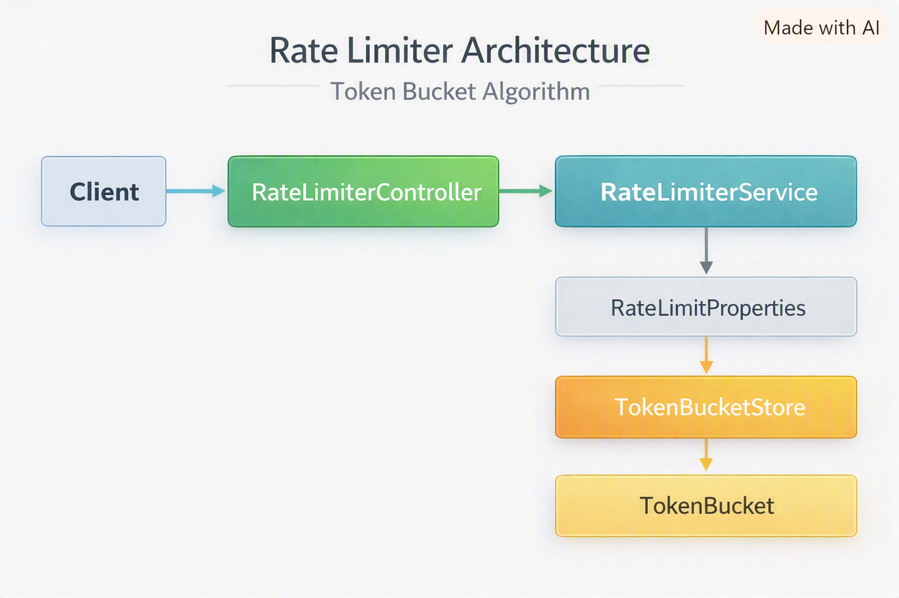

# Rate Limiter Service

<p align="center">
  
  
  
  
  
  
  
  
  
</p>

---

## Overview
A production‑style rate limiter microservice built with Spring Boot. It implements the token bucket algorithm, supports
per‑API‑key rate limits, uses config‑driven architecture, and ensures thread‑safe concurrency through a dedicated bucket
store. The service exposes a simple REST API and includes full unit test coverage for algorithmic behavior.

---

## Features

- **Token bucket algorithm** - precise refill and consume logic
- **Thread‑safe bucket store** - concurrency handled through a dedicated in‑memory store
- **Per‑key rate limits** - configurable defaults and overrides
- **Config‑driven design** - values loaded from `application.yml` or environment variables
- **Layered architecture** - Controller → Service → Store → Algorithm
- **REST API** - simple `/check` endpoint with clear request/response DTOs
- **Unit test coverage** - timing‑sensitive algorithm and service tests
- **Dockerized deployment** - consistent, portable runtime environment

---

## Why This Project Matters

This project demonstrates real backend engineering capability through a correct algorithm implementation, safe
concurrency handling, clean architecture, strong test coverage, and production‑ready packaging. It shows how to
build a small but robust service that behaves predictably under load and is easy to configure, test, and deploy.

---

## Table of Contents

- [Architecture Summary](#architecture-summary)
- [Running Locally](#running-locally)
- [Running with Docker](#running-with-docker)
- [Configuration](#configuration)
- [Example curl Commands](#example-curl-commands)
- [Architecture Diagram](#architecture-diagram)
- [Roadmap](#roadmap)
- [Contributing](#contributing)
- [Contributors](#contributors)
- [Author](#author)
- [Change Log](#change-log)
- [License](#license)

---

## Architecture Summary

This service follows a clean layered architecture:

- RateLimiterController - exposes the `/check` endpoint
- RateLimiterService - loads config, manages buckets, applies rate limits
- TokenBucketStore - thread‑safe bucket storage using ConcurrentHashMap
- TokenBucket - core algorithm (refill and consume)
- RateLimitProperties - config binding for per‑key limits

Requests flow through these layers in a predictable, testable way.

---

## Running Locally

```bash
./mvnw spring-boot:run
```

---

## Running with Docker

```bash
docker build -t rate-limiter .
docker run -p 8080:8080 rate-limiter
```

---

## Configuration

Rate limits are defined in `application.yml`:

- Capacity
- Refill rate
- Default limits
- Per‑key overrides

These can be overridden using environment variables or mounted config files when running in Docker or Kubernetes.

### Example `application.yml`

Below is a minimal configuration showing default limits and per‑key overrides:

```yaml
rate-limiter:
  default:
    capacity: 10
    refillRate: 5

  keys:
    user123:
      capacity: 5
      refillRate: 2

    premiumUser:
      capacity: 20
      refillRate: 10
```

---

## Example curl Commands

### JSON body (recommended)

This is the primary and most accurate way to call the API.

```bash
curl -X POST http://localhost:8080/check -H "Content-Type: application/json" -d "{\"apiKey\":\"user123\"}"
```

Example response:

```json
{
  "allowed": true,
  "remainingTokens": 19.0
}
```

### Query parameter (alternative form)

If you prefer passing the key as a query parameter, the service supports that too.

#### Consume a token

First request - consumes one token from the bucket:

```bash
curl -X POST "http://localhost:8080/check?apiKey=user123"
```

#### Hit the limit

Repeat the request until the bucket is empty:

```bash
curl -X POST "http://localhost:8080/check?apiKey=user123"
```

#### Different key with different limits

``` bash
curl -X POST "http://localhost:8080/check?apiKey=premiumUser"
```

#### Missing API key

```bash
curl -X POST "http://localhost:8080/check"
```

---

## Architecture Diagram



---

## Roadmap

### Phase 1 - Core Build (Completed)

The initial phase delivered a fully working, production‑style rate limiter service.

- Project setup and clean architecture foundation
- Token bucket algorithm implementation
- Thread‑safe bucket store and service layer
- REST API with request/response DTOs
- Unit tests for algorithm and service behavior
- Dockerfile + documentation + architecture diagram

### Phase 2 - Future Enhancements

Planned improvements to evolve the service toward distributed, scalable, and observable production use.

- Distributed rate limiting using Redis
- Sliding window algorithm option
- Prometheus/Grafana metrics
- Integration and load testing

---

## Contributing

1. Fork the repo
2. Create a feature branch
3. Commit your changes
4. Push your branch
5. Open a pull request

---

## Contributors

A huge thank you to everyone who has put their time and effort into improving this project.

| Name                  | GitHub                                                                | Role                      |
|-----------------------|-----------------------------------------------------------------------|---------------------------|
| **David Fifer**       | [@davidfifer](https://github.com/davidfifer)                          | Creator & Maintainer      |
| **Community Members** | [Open a PR](https://github.com/davidfifer/davidfifer-portfolio/pulls) | Features, fixes, feedback |

If you’d like to contribute, check out the [Contributing](#contributing) and submit a pull request.

---

## Author

David Fifer – [@AuthorLinkedIn](https://www.linkedin.com/in/david-b-fifer) – davidfifer47@gmail.com

---

## Change Log

| Version   | Notes           |
|-----------|-----------------|
| **1.0.0** | Initial release |

---

## License

[](https://opensource.org/licenses/MIT)

Licensed under the MIT License. See [LICENSE](LICENSE) for full terms.
