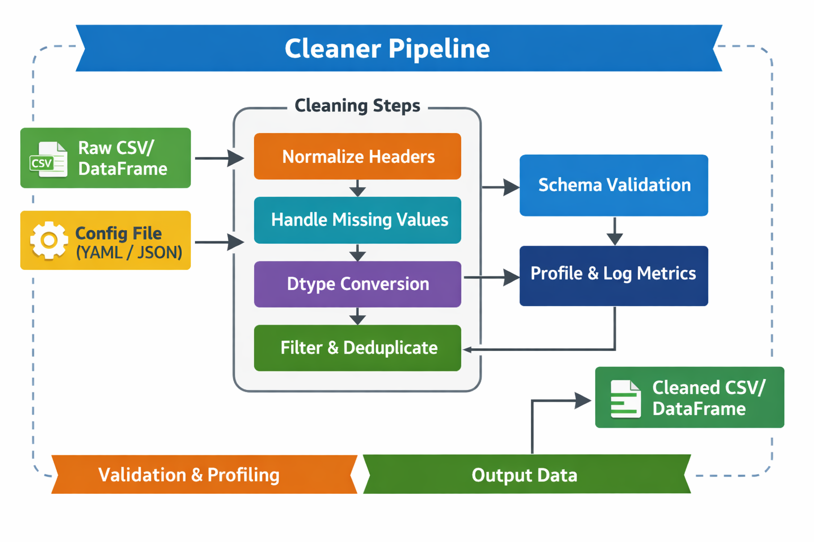

# CSV Cleaning Utility

<p align="center">
  
  
  
  
  
  
  
</p>

A configuration‑driven CSV cleaning and profiling utility built for data engineers, analysts, and automation workflows.
It provides a deterministic multi‑stage cleaning pipeline, strict validation rules, profiling metrics, and a clean
Typer‑based CLI interface.

---

## Overview

CSV files are notoriously inconsistent with messy headers, mixed types, malformed dates, duplicate rows, and unpredictable
whitespace. These issues break pipelines, corrupt analytics, and slow down development.

**csv_cleaner** solves this by providing:

- A deterministic, multi‑stage cleaning pipeline
- Strict validation for numeric and date fields
- Configurable rules for trimming, filtering, and schema enforcement
- Profiling metrics for data quality inspection
- A clean Typer CLI ideal for automation, cron jobs, and ETL workflows

Supported cleaning operations include column normalization, missing‑value handling, data‑type fixing, string trimming,
duplicate removal, and row‑level filtering.

<p align="center">
  
  <br>
  <em>Figure: CSV Cleaning Pipeline Flow</em>
</p>

---

**Table of Contents**

- [Roadmap](#roadmap)
- [Features](#features)
- [Installation](#installation)
- [Configuration](#configuration)
- [Usage](#usage)
- [CLI Reference](#cli-reference)
- [Testing](#testing)
- [Technologies](#technologies)
- [Contributing](#contributing)
- [Contributors](#contributors)
- [Author](#author)
- [Change log](#change-log)
- [License](#license)

---

## Roadmap

This project continues to evolve into a flexible, production‑grade data‑cleaning toolkit. The roadmap below reflects the
current state of the cleaner and the next set of enhancements focused on reliability, performance, and extensibility.

### Validation & Safety

- Schema validation for configuration files using Pydantic or JSON Schema
- Ensures configs are well‑formed, typed correctly, and fail fast when misconfigured.

### Quality & Testing

- Unit test suite covering normalization, missing‑value strategies, dtype conversion, trimming, deduplication, and row
filters
- Improves confidence and prevents regressions as the cleaner evolves.

### Observability & Debugging

- Logging and debug mode
- Provides detailed insight into which cleaning steps ran, how many rows changed, and why.

### Performance & Scalability

- Performance refactor
- Reduces unnecessary copies, optimizes dtype scans, and improves handling of large datasets.

### Extensibility

- Plugin/extension hooks
- Allows users to inject custom cleaning functions into the pipeline.

### Documentation & Examples

- Example datasets and tutorials
- Demonstrates real‑world usage patterns and before/after transformations.

### Completed

- Deterministic multi‑stage cleaning pipeline
- Config‑driven behavior (YAML/JSON)
- Strict numeric and date validation
- Missing‑value strategies (mean, median, literal)
- Dtype enforcement (int, float, bool, string, datetime)
- Duplicate removal with subset + case‑insensitive mode
- Row‑level filtering (required columns, ranges, regex, keep‑if)
- Typer‑based CLI with helpful errors
- Profiling metrics via Profiler
- Exporter for saving cleaned CSVs

### Planned

- Schema auto‑inference
- Column‑level statistics in profiler
- Optional dry‑run mode
- More advanced regex filtering
- Built‑in config templates

---

## Features

### Multi‑Stage Cleaning Pipeline

The pipeline runs in a deterministic order:

- Normalize column names
- Validate headers
- Drop extra columns
- Trim strings
- Remove empty rows
- Validate numeric fields
- Enforce data types
- Fill missing values
- Validate dates
- Remove duplicates
- Apply row‑level filters

---

### Column Normalization

- Lowercase
- Strip whitespace
- Replace spaces with underscores
- Remove non‑alphanumeric characters
- Collapse underscores
- Prefix digit‑starting names
- Apply alias mappings

---

### Strict Numeric Validation

- Ensures any non‑numeric value triggers an immediate failure

---

### Date Validation (Strict or Flexible)

- Optional format enforcement
- Strict mode rejects malformed dates
- Non‑strict mode allows NaT

---

### Missing‑Value Strategies

Per‑column strategies:

- mean
- median
- Literal values

---

### Dtype Enforcement

Supports:

- int → Int64
- float → float64
- bool
- string
- datetime

---

### Duplicate Removal

Modes:

- first
- last
- none (drop all duplicates)

Case‑insensitive subset matching supported.

---

### Row‑Level Filtering

Required columns

- Drop‑equals
- Numeric ranges
- Regex matching
- Keep‑if whitelist

---

## Installation

```shell
$ git clone https://github.com/davidfifer/davidfifer-portfolio.git
$ cd davidfifer-portfolio/python/csv_data_cleaner
$ pip install .
````
For development:

```shell
$ pip install -e .
```
This uses the build metadata defined in pyproject.toml under the [project] section.

---

## Configuration

This project uses a YAML‑driven configuration system to define all normalization, validation, typing, and filtering
rules applied to incoming datasets. The configuration is designed to be explicit, predictable, and fully declarative,
allowing you to control behavior without modifying code.

### YAML Structure

The following example shows a complete configuration file with all supported sections:

```yaml
normalize_columns:
  enabled: true
  alias_map:
    e-mail: email

headers:
  enabled: true
  required: ["id", "email"]
  allow_unnamed: false

schema:
  enabled: true
  required: ["id", "email", "created_at"]
  drop_extra: true

trim_strings:
  enabled: true
  columns: ["email"]

numeric:
  enabled: true
  columns: ["age", "score"]

dtypes:
  enabled: true
  columns:
    age: int
    score: float
    created_at: datetime

fill_missing_values:
  enabled: true
  columns:
    score: mean
    status: "unknown"

dates:
  enabled: true
  columns: ["created_at"]
  format: "%Y-%m-%d"
  strict: true

remove_duplicates:
  enabled: true
  subset: ["email"]
  keep: "first"
  case_insensitive: true

row_filters:
  enabled: true
  required_columns: ["email"]
  drop_if_equals:
    status: ["inactive", "banned"]
  numeric_ranges:
    score:
      min: 0
      max: 100
  regex:
    email: "^[^@]+@[^@]+$"
  keep_if:
    country: ["US", "CA"]
```

---

## Usage

### Clean a CSV

```shell
$ python -m csv_cleaner clean data.csv -c config.yaml -o cleaned.csv
```

### Clean + Show Profile

```shell
$ python -m csv_cleaner clean --show-profile data.csv -c config.yaml -o cleaned.csv
```

### Profile Only

```shell
$ python -m csv_cleaner profile data.csv
```

### Show Version

```shell
$ python -m csv_cleaner version
```

---

## CLI Reference

The CLI is built using Typer:

- CSV Cleaner – cleanup and profile CSV files

### Commands

| Command     | Description                           |
|-------------|---------------------------------------|
| **clean**   | Clean a CSV using configuration rules |
| **profile** | Display profiling metrics             |
| **version** | Show tool version                     |

### Required Arguments

| Argument          | Description                          |
|-------------------|--------------------------------------|
| **file_path**     | Path to the CSV file                 |
| **--config / -c** | Path to YAML/JSON configuration file |
| **--output / -o** | Output CSV path                      |

### Optional Flags

| Flag               | Description                            |
|--------------------|----------------------------------------|
| **--show-profile** | Display cleaning and profiling metrics |

---

## Testing

Create a sample CSV:

```shell
echo "id,email,score" > test.csv
echo "1,test@example.com,90" >> test.csv
echo "2,invalid-email,abc" >> test.csv
```

### Run cleaner:

```shell
python -m csv_cleaner clean test.csv -c config.yaml -o out.csv
```

---

## Technologies

| Technology       | Purpose                       |
|------------------|-------------------------------|
| **Python 3.10+** | Core language                 |
| **pandas**       | Data processing engine        |
| **Typer**        | CLI framework                 |
| **YAML/JSON**    | Configuration system          |
| **Logging**      | Configurable logging pipeline |
| **Profiler**     | Data quality metrics          |
| **CSV Exporter** | Output writer                 |

---

## Contributing

To contribute to the development of csv_data_cleaner, follow the steps below:

1. Fork csv_data_cleaner from https://github.com/davidfifer/davidfifer-portfolio/python/fork
2. Create your feature branch (`git checkout -b feature-new`)
3. Make your changes
4. Commit your changes (`git commit -am 'Add new feature'`)
5. Push to the branch (`git push origin feature-new`)
6. Open a pull request

---

## Contributors

A huge thank you to everyone who has put their time and effort into improving this project.

| Name            | GitHub                                       | Role                      |
|-----------------|----------------------------------------------|---------------------------|
| **David Fifer** | [@davidfifer](https://github.com/davidfifer) | Creator & Maintainer      |
| **Community**   | PRs welcome                                  | Features, Fixes, Feedback |

If you’d like to contribute, check out the [Contributing](#contributing) and submit a pull request.

---

## Author

David Fifer – [@AuthorLinkedIn](https://www.linkedin.com/in/david-b-fifer) – davidfifer47@gmail.com

---

## Change Log

| Version   | Notes           |
|-----------|-----------------|
| **1.0.0** | Initial release |

---

## License

[](https://opensource.org/licenses/MIT)

Licensed under the MIT License. See [LICENSE](LICENSE) for full terms.
