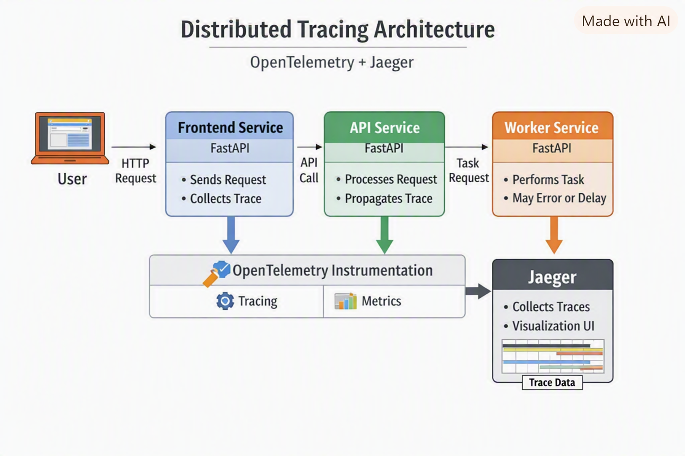
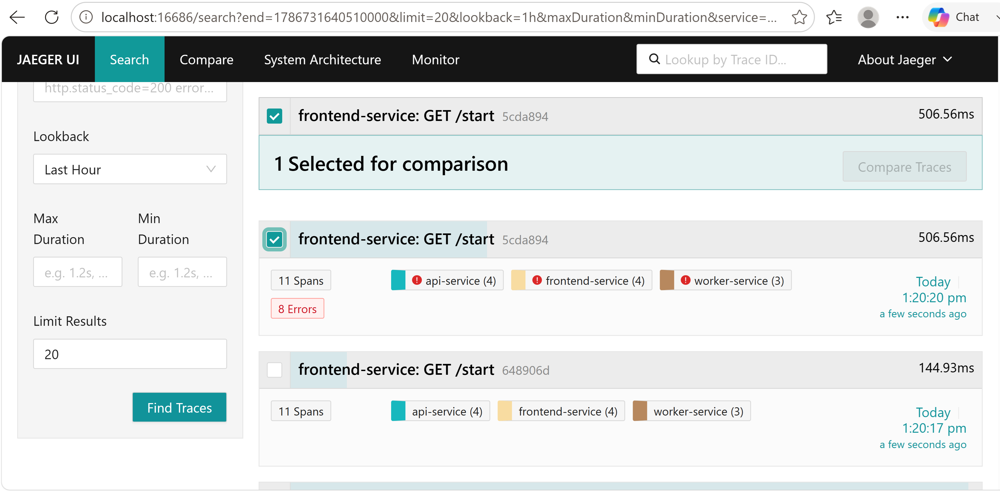

## Architecture Diagram

The distributed tracing demo consists of three FastAPI microservices orchestrated via Docker Compose and instrumented
with OpenTelemetry. Each service emits spans to Jaeger, enabling full visibility into latency and error propagation
across the system.

**Flow Overview**

| Component            | Role                          | Key Features                      |
|----------------------|-------------------------------|-----------------------------------|
| **Frontend Service** | Entry point for user requests | Calls API Service, starts trace   |
| **API Service**      | Business logic layer          | Propagates trace, injects latency |
| **Worker Service**   | Task executor                 | Simulates slow/error responses    |
| **Jaeger**           | Trace collector + UI          | Visualizes spans and timing       |

---

## Sequence Diagrams

The following sequence illustrates how a single request travels through the system:

1. User sends GET/start to Frontend Service.
2. Frontend Service calls API Service /process.
3. API Service calls Worker Service /work.
4. Worker Service performs work (may delay or fail).
5. Each service emits spans to Jaeger via OpenTelemetry.
6. Jaeger UI displays the full trace timeline.

---

## Jaeger Trace Screenshot

Below is an example of a trace captured in Jaeger showing latency propagation and error handling across services.

Trace Highlights

- Parent span: frontend-service /start
- Child spans: api-service /process, worker-service /work
- Latency ≈ 300–700 ms depending on chaos mode
- Errors appear as red spans in the timeline
