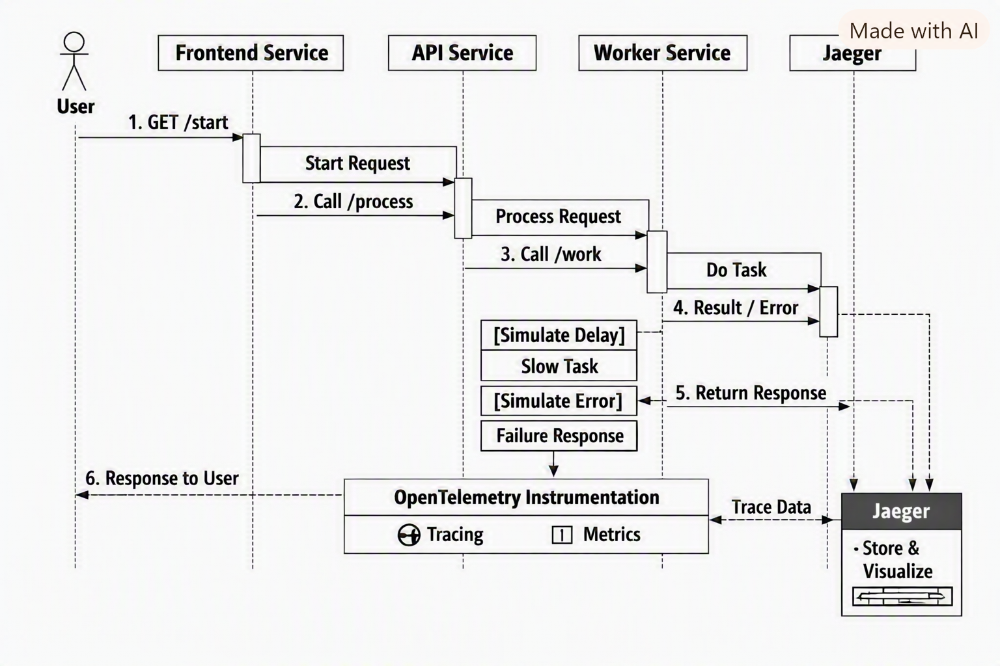

# Distributed Tracing Demo

<p align="center">
  
  
  
  
  
  
  
  
  
  
  
</p>

A clean microservice system demonstrating distributed tracing, latency propagation, error propagation, and chaos mode
using FastAPI, OpenTelemetry, Jaeger, and Docker Compose.

---

## Overview

This project consists of three FastAPI microservices instrumented with OpenTelemetry:

- **frontend-service** - entrypoint, starts the trace
- **api-service** - adds latency, performs retries, calls worker
- **worker-service** - performs work, simulates queueing, may delay or fail
- **Jaeger** - collects and visualizes traces
- **Prometheus** - exposes metrics from all services
- **Docker Compose** - orchestrates everything

The system demonstrates:

- Distributed tracing
- Trace context propagation
- Latency injection
- Retry logic with backoff
- Queue depth + queue wait simulation
- Error propagation
- Chaos mode
- Multi-service architecture
- Prometheus metrics
- Jaeger visualization

---

## Prerequisites

Before running the distributed tracing demo, ensure you have the following installed:

- **Docker** (20.x or later)
- **Docker Compose** (v2.x)
- **Git** (optional, for cloning)
- **Python 3.11** (optional, only needed for local development outside Docker)

All services run fully containerized, so Docker + Docker Compose are the only hard requirements.

---

## Features

- **Distributed tracing** across three FastAPI microservices
- **OpenTelemetry instrumentation** (auto + manual spans)
- **Trace context propagation** through HTTP calls
- **Chaos mode** with randomized delays and failures
- **Retry logic** with backoff in the API service
- **Queue simulation** in the worker service
- **Prometheus metrics** for chaos, retries, and queue latency
- **Jaeger visualization** of spans, timing, and errors
- **Docker Compose** orchestration for full local environment
- **Architecture + sequence diagrams** included in `./docs`
- **Curl examples** for testing and debugging

---

## Why This Project Matters

Modern distributed systems rely on observability to diagnose latency, failures, and cross‑service behavior. This demo
highlights:

- How trace context flows through multiple services
- How downstream failures propagate upstream
- How retries appear in traces
- How queue depth affects latency
- How chaos mode reveals system fragility
- How Prometheus metrics complement tracing
- How Jaeger visualizes timing, errors, and service interactions

It is intentionally small, readable, and designed for experimentation.

---

## Technologies

- **Python 3.11**
- **FastAPI**
- **OpenTelemetry SDK**
- **OTLP/HTTP Exporter**
- **Jaeger** (via OpenTelemetry Collector)
- **Prometheus + prometheus_fastapi_instrumentator**
- **Docker & Docker Compose**
- **Requests** for service-to-service HTTP calls

---

## Quick Start

The fastest way to run the full distributed tracing environment:

1. Clone the repository

```bash
git clone https://github.com/davidfifer/distributed_tracing_demo.git
cd distributed_tracing_demo
```

2. Start all services

```bash
docker-compose up --build
```

3. Trigger a trace

```bash
curl http://localhost:8000/start
```

4. Open Jaeger UI

```code
http://localhost:16686
```

You should now see traces flowing through frontend → api → worker with chaos mode, retries, and queue simulation.

---

## Table of Contents

- [Architecture Diagram](#architecture-diagram)
- [Sequence Diagram](#sequence-diagram)
- [Span Attribute Reference](#span-attribute-reference)
- [Chaos Mode Scenarios](#chaos-mode-scenarios)
- [Project Structure](#project-structure)
- [Running the System](#running-the-system)
- [Curl Examples](#curl-examples)
- [How Tracing Works](#how-tracing-works)
- [Screenshots](#screenshots)
- [Roadmap](#roadmap)
- [Contributing](#contributing)
- [Contributors](#contributors)
- [Author](#author)
- [Change Log](#change-log)
- [License](#license)

---

## Architecture Diagram

The distributed tracing demo consists of three FastAPI microservices orchestrated via Docker Compose and instrumented
with OpenTelemetry.

### High-Level Flow


**Flow Overview**

| Component            | Role                 | Key Behaviors                             |
|----------------------|----------------------|-------------------------------------------|
| **Frontend Service** | Entry point          | Starts trace, calls API                   |
| **API Service**      | Mid-tier logic       | Injects latency, retries worker calls     |
| **Worker Service**   | Downstream executor  | Queue simulation, chaos failures          |
| **Jaeger**           | Trace collector + UI | Visualizes spans, timing, errors          |
| **Prometheus**       | Metrics backend      | Chaos counts, retry counts, queue latency |

---

## Sequence Diagram

The following sequence illustrates how a single request travels through the system:



1. User sends `GET /start` to the frontend service.
2. Frontend service calls api service `/process`.
3. API service calls worker service `/work`.
4. Worker service performs work (may delay or fail).
5. All services emit spans to Jaeger.
6. Jaeger displays the full trace timeline.

---

## Span Attribute Reference

<details>
<summary><strong>Click to expand span attributes</strong></summary>

### Frontend Service

| Attribute               | Meaning                      |
|-------------------------|------------------------------|
| ``chaos.enabled``       | Whether chaos mode is active |
| ``api.url``             | URL of API call              |
| ``latency.injected_ms`` | Chaos-mode latency           |
| ``error``               | Whether an error occurred    |

### API Service

| Attribute               | Meaning                       |
|-------------------------|-------------------------------|
| ``retry.attempt``       | Retry number                  |
| ``retry.success``       | Whether the attempt succeeded |
| ``retry.backoff_ms``    | Backoff delay                 |
| ``worker.url``          | URL of worker call            |
| ``latency.injected_ms`` | Chaos-mode latency            |
| ``error``               | Worker failure propagated     |

### Worker Service

| Attribute               | Meaning                   |
|-------------------------|---------------------------|
| ``queue.depth``         | Simulated queue depth     |
| ``queue.wait_ms``       | Queue wait time           |
| ``latency.injected_ms`` | Chaos-mode latency        |
| ``worker.failure``      | Simulated failure         |
| ``error``               | Error propagated upstream |

</details>

---

## Chaos Mode Scenarios

<details>
<summary><strong>Click to expand chaos scenarios</strong></summary>

Chaos mode simulates real-world instability across all services.

### Frontend Chaos

| Behavior       | Probability          |
|----------------|----------------------|
| Inject latency | 100% when chaos=true |
| Error          | Only if API fails    |

### API Chaos

| Behavior       | Probability                |
|----------------|----------------------------|
| Inject latency | 100% when chaos=true       |
| Worker retries | Depends on worker failures |
| Error          | If all retries fail        |

### Worker Chaos

| Behavior          | Probability |
|-------------------|-------------|
| Inject 1.5s delay | 20%         |
| Raise failure     | 10%         |

</details>

---

## Project Structure

<details>
<summary><strong>Click to expand project structure diagram</strong></summary>

```text
distributed_tracing_demo/
│
├── frontend-service/
│   ├── src/main.py
│   ├── requirements.txt
│   ├── Dockerfile
│   └── README.md
│
├── api-service/
│   ├── src/main.py
│   ├── requirements.txt
│   ├── Dockerfile
│   └── README.md
│
├── worker-service/
│   ├── src/main.py
│   ├── requirements.txt
│   ├── Dockerfile
│   └── README.md
│
├── infra/
│   ├── docker-compose.yml
│   └── jaeger/config.yaml
│
└── docs/
    ├── diagrams/
    │   ├── sequence.png
    │   └── services_architecture.png
    └── screenshots/
        └── chaos_mode_trace.png
        └── jaeger_trace_chaos_true.png
        └── normal_mode_trace.png
```

</details>

---

## Running the System

```bash
docker-compose up --build
```

### Hit the entrypoint:

```bash
curl http://localhost:8000/start
```

---

## Curl Examples

<details>
<summary><strong>Click to expand curl examples</strong></summary>

### Basic request

```bash
curl "http://localhost:8000/start"
```

### Chaos mode

```bash
curl "http://localhost:8000/start?chaos=true"
```

### API direct

```bash
curl "http://localhost:8001/process?chaos=true"
```

### Worker direct

```bash
curl "http://localhost:8002/work?chaos=true"
```

</details>

---

## How Tracing Works

### Automated Instrumentation

All services use OpenTelemetry auto-instrumentation:

- FastAPI inbound spans
- Requests outbound spans
- Automatic trace context propagation

### Manual Spans

Each service adds custom spans:

- `frontend.start`, `frontend.call_api`
- `api.process`, `api.call_worker`
- `worker.work`

### Trace Hierarchy

```code
frontend.start
    frontend.call_api
        api.process
            api.call_worker
                worker.work
```

### Chaos Mode

Chaos mode introduces:

- Random latency
- Random worker failures
- Retry attempts
- Error propagation

### Error Propagation

Worker failures propagate upward:

- Worker span → red
- API span → red
- Frontend span → red

---

## Screenshots

Screenshots are stored under:

```code
./docs/screenshots/
```

---

## Roadmap

<details>
<summary><strong>Click to expand roadmap</strong></summary>

### Phase 1 - Completed

Phase 1 focused on building a complete distributed tracing demo with realistic latency, failure, and retry behavior.

#### Core Tracing Infrastructure

- Added OpenTelemetry SDK + OTLP exporters
- Added FastAPI + Requests auto-instrumentation
- Added manual spans across all services
- Added trace context propagation end-to-end

#### Chaos Mode Implementation

- Frontend latency injection
- API latency injection
- Worker latency + failure injection
- Chaos attributes added to spans
- Chaos counters added to Prometheus

#### Retry Logic (API Service)

- Implemented retry loop with backoff
- Added retry span attributes
- Added Prometheus retry counter
- Added error propagation on final failure

#### Queue Simulation (Worker Service)

- Added queue depth attribute
- Added queue wait histogram
- Added queue wait latency to spans

#### Metrics Integration

- Prometheus instrumentation for all services
- Chaos counters
- Retry counters
- Queue wait histograms

#### Documentation Improvements

- Full service-level READMEs
- Architecture diagram
- Sequence diagram
- Span attribute reference tables
- Chaos scenario tables
- Updated main README

### Phase 2 - Future Enhancements

These enhancements are planned for future iterations to deepen observability, reliability, and operational insight:

#### Grafana dashboards

- Visualize latency, retries, queue depth, and chaos impact

#### Service Level Objectives (SLOs)

- Define latency/error targets and track error budgets

#### Prometheus alerts

- Detect retry spikes, queue overflow, and worker failures

#### Trace analysis documentation

- Explain distributed trace behavior and failure propagation

#### Additional chaos scenarios

- CPU burn, memory pressure, queue overflow, random worker crashes

</details>

---

## Contributing

1. Fork the repo
2. Create a feature branch
3. Commit your changes
4. Push your branch
5. Open a pull request

---

## Contributors

A huge thank you to everyone who has put their time and effort into improving this project.

| Name                  | GitHub                                                                | Role                      |
|-----------------------|-----------------------------------------------------------------------|---------------------------|
| **David Fifer**       | [@davidfifer](https://github.com/davidfifer)                          | Creator & Maintainer      |
| **Community Members** | [Open a PR](https://github.com/davidfifer/davidfifer-portfolio/pulls) | Features, fixes, feedback |

If you’d like to contribute, check out the [Contributing](#contributing) and submit a pull request.

---

## Author

David Fifer – [@AuthorLinkedIn](https://www.linkedin.com/in/david-b-fifer) – davidfifer47@gmail.com

---

## Change Log

| Version   | Notes           |
|-----------|-----------------|
| **1.0.0** | Initial release |

---

## License

[](https://opensource.org/licenses/MIT)

Licensed under the MIT License. See [LICENSE](LICENSE) for full terms.
