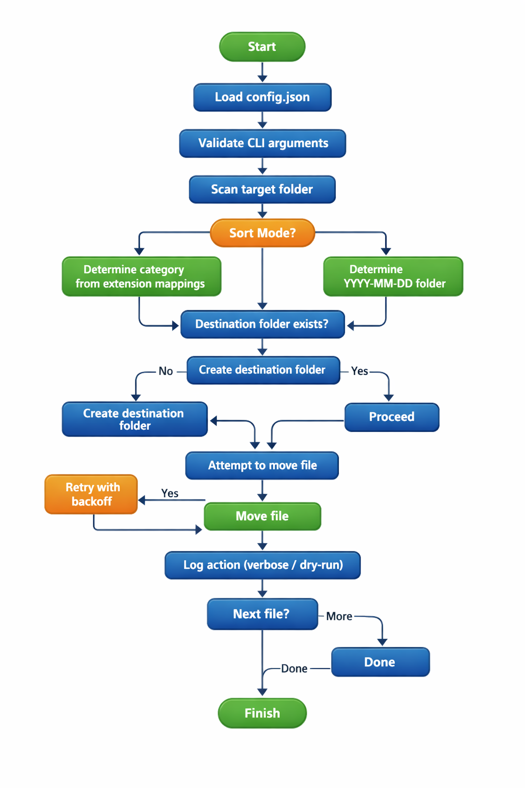

# File Sorting Utility

<div style="display: flex; justify-content: center; flex-wrap: wrap; gap: 6px;">
  
  
  
  
  
  
  
  
</div>


A cross‑platform, configuration‑driven Python utility that organizes files by extension or last modified date, supports dry‑run previews, handles file locks, and provides a clean, validated CLI interface for automation and scripting.

---

## Overview

Most developers eventually end up with directories that turn into digital junk drawers download folders full of installers, screenshots, logs, and random artifacts. Over time, this clutter slows down workflows and complicates automation.

**file_organizer** solves this problem by providing a predictable, configuration‑driven way to keep directories clean without manual cleanup or brittle one‑off scripts. It offers:

- A consistent sorting engine across Windows, macOS, and Linux  
- A declarative JSON configuration model  
- A safe dry‑run mode for previewing changes  
- Robust file‑lock handling  
- A clean CLI interface ideal for cron jobs, scheduled tasks, and developer tooling  

In short, this tool turns a recurring annoyance into a reliable, repeatable workflow that’s easy to automate and customize.

<div style="text-align:center;">
  
  <p><em>Figure: File Sorting Utility process flow</em></p>
</div>

---

**Table of Contents**

- [Roadmap](#roadmap)
- [Features](#features)
- [Installation](#installation)
- [Configuration](#configuration)
- [Usage](#usage)
- [Command‑Line Interface (CLI) Reference](#command-line-interface-cli-reference)
- [Testing](#testing)
- [Technologies](#technologies)
- [Contributing](#contributing)
- [Contributors](#contributors)
- [Author](#author)
- [Change log](#change-log)
- [License](#license)

---

## Roadmap

### Completed

Core sorting engine (extension + date modes)
- Config‑driven behavior with JSON mappings 
- Dry‑run mode for safe previews
- Cross‑platform file‑lock handling (Windows + Unix)
- Verbose logging with -v and -vv 
- CLI interface with validation and helpful errors 
- PEP 621 packaging via pyproject.toml

### Planned
- Use mimetypes or python-magic to classify files more accurately than extensions.
- Enhanced config schema with optional per‑category rules
- Sort nested folders automatically.
- Simulate flag (--simulate) unified with dry‑run logic
- .gitignore‑style exclusion rules for files and directories.

---

## Features

- Sort by Extension — Group files into subfolders based on their file type
- Sort by Modified Date — Organize files into date‑named folders (YYYY‑MM‑DD)
- Dry‑run Mode — Preview actions without modifying the filesystem
- Clean CLI Interface — --folder_path, --sort_mode, --verbose
- Verbose Logging — Adjustable via CLI flags
- Config‑Driven Behavior — Supported file types and dry‑run mode are defined in config.json
- Automatic Directory Creation — Creates destination folders on demand
- File‑Lock Detection — Retries moving locked files with configurable backoff
- Retry Logic — Retries locked files with configurable delay
- Graceful Error Handling — Logs warnings without interrupting the process
- Cross‑Platform File Lock Detection — Uses msvcrt on Windows and fcntl on Unix

Errors raised during the move are caught and logged without interrupting the overall sorting process.

Supported file types and dry‑run mode are read from the JSON config.

---

## Installation

```shell
$ git clone https://github.com/davidfifer/davidfifer-portfolio.git
$ cd davidfifer-portfolio/python/file_organizer
$ pip install .
````
For development:

```shell
$ pip install -e .
```
This uses the build metadata defined in pyproject.toml under the [project] section.

---

## Configuration

Supported file types and dry‑run mode are read from the config JSON file. Below is an example file for reference. 
```
{
  "supported_file_types": {
    "images": [".jpg", ".jpeg", ".png", ".gif", ".bmp", ".tiff"],
    "documents": [".pdf", ".txt", ".md", ".doc", ".docx", ".xls", ".xlsx"],
    "archives": [".zip", ".tar", ".gz"]
  },
  "dry_run_mode": false
}
```
You may customize categories, add new extensions, or enable dry‑run mode globally.

---

## Usage

Once installed, run the utility using the module entry point:

Sort by Extension

```shell
$ python -m file_organizer --folder_path "/path/to/downloads" --sort_mode extension
```
Sort by Modified Date

```shell
$ python -m file_organizer --folder_path "/path/to/downloads" --sort_mode date
```
Enable Verbose Logging

```shell
$ python -m file_organizer --folder_path "/path/to/downloads" --sort_mode extension -vv
```
Dry‑run mode logs intended actions without moving files.

Enable in config.json:
```
"dry_run_mode": true
```

Using the Library in Python:

```python
from file_organizer import main, sort_by_extension, sort_by_modified_date
```

---

## Command-Line Interface (CLI) Reference

The file_organizer utility provides a clean, validated command‑line interface for sorting files by extension or last‑modified date. This section documents all available commands, flags, and behaviors.

### Basic Command

```shell
python -m file_organizer [OPTIONS]
```

Run the tool using the module entry point:

### Required Arguments

**--folder_path**
Folder path of the directory you want to organize.  
Must be a valid, existing directory.

```shell
python -m file_organizer --folder_path "/path/to/downloads"
```

**--sort_mode**  
Determines how files are organized.

Supported values:

- extension — Sort into folders based on file type  
- date — Sort into folders based on last‑modified date (YYYY‑MM‑DD)

```shell
python -m file_organizer --folder_path "/path" --sort_mode extension
```

### Optional Arguments

Controls logging detail:

- v — verbose  
- vv — very verbose (debug‑level detail)

```shell
python -m file_organizer --folder_path "/path" --sort_mode date -vv
```

### Behavior Summary

| Feature                                                                           | Description                                                                       |
|-----------------------------------------------------------------------------------|-----------------------------------------------------------------------------------|
| **[Extension Sorting](ca://s?q=Tell_me_more_about_sorting_by_extension)**         | Files grouped into category folders based on extension mappings in `config.json`. |
| **[Date Sorting](ca://s?q=Tell_me_more_about_sorting_by_modified_date)**          | Files grouped into folders named `YYYY‑MM‑DD`.                                    |
| **[Dry‑Run Mode](ca://s?q=Tell_me_more_about_dry_run_mode)**                      | Logs actions without modifying the filesystem.                                    |
| **[Verbose Logging](ca://s?q=Explain_verbose_logging_levels)**                    | Adds detailed output for debugging or automation.                                 |
| **[File‑Lock Handling](ca://s?q=Explain_file_lock_detection)**                    | Retries locked files with backoff (Windows + Unix).                               |
| **[Automatic Directory Creation](ca://s?q=Explain_automatic_directory_creation)** | Creates destination folders as needed.                                            |

---

## Testing

Create a temporary directory with mixed files:

```shell
mkdir testfiles
touch testfiles/a.txt testfiles/b.jpg testfiles/c.zip

python -m file_organizer --folder_path testfiles --sort_mode extension
```

---

## Technologies

This project is built using the following technologies:

- **Python 3.10+** — Core language used for all functionality
- **Standard Library Modules** — os, shutil, argparse, logging, time, datetime, msvcrt (Windows), fcntl (Unix)
- **Configuration** — JSON-based config system for category mappings and dry-run behavior
- **CLI Framework** — argparse for validated command-line interfaces
- **Cross-Platform Support** — Windows, macOS, and Linux compatibility
- **File Lock Handling** — msvcrt (Windows) and fcntl (Unix) for safe file operations
- **Logging System** — Configurable logging with verbose and debug modes
- **Packaging** — pyproject.toml (PEP 621 metadata) for installation and distribution
- **Development Environment** — PyCharm, virtual environments, pip editable installs
- **Version Control** — Git and GitHub for source management

---

## Contributing

To contribute to the development of file_organizer, follow the steps below:

1. Fork file_organizer from https://github.com/davidfifer/davidfifer-portfolio/python/fork
2. Create your feature branch (`git checkout -b feature-new`)
3. Make your changes
4. Commit your changes (`git commit -am 'Add new feature'`)
5. Push to the branch (`git push origin feature-new`)
6. Open a pull request

---

## Contributors

A huge thank you to everyone who has put their time and effort into improving this project.

| **[Name](ca://s?q=Tell_me_more_about_contributor_names)** | **[GitHub](ca://s?q=Explain_contributor_github_links)**                      | **[Contributions](ca://s?q=Explain_contribution_roles)** |
|-----------------------------------------------------------|------------------------------------------------------------------------------|----------------------------------------------------------|
| **David Fifer**                                           | [@davidfifer](https://github.com/davidfifer)                                 | Creator, architect, and maintainer                       |
| **Community Members**                                     | [Open a PR](https://github.com/davidfifer/davidfifer-portfolio/python/pulls) | Features, fixes, feedback                                |

If you’d like to contribute, check out the [Contributing](#contributing) and submit a pull request.

---

## Author

David Fifer – [@AuthorLinkedIn](https://www.linkedin.com/in/david-b-fifer) – davidfifer47@gmail.com

---

## Change Log

- 0.0.1
    * First working version

---

## License

[](https://opensource.org/licenses/MIT)

Licensed under the MIT License. See [LICENSE](LICENSE) for full terms.
